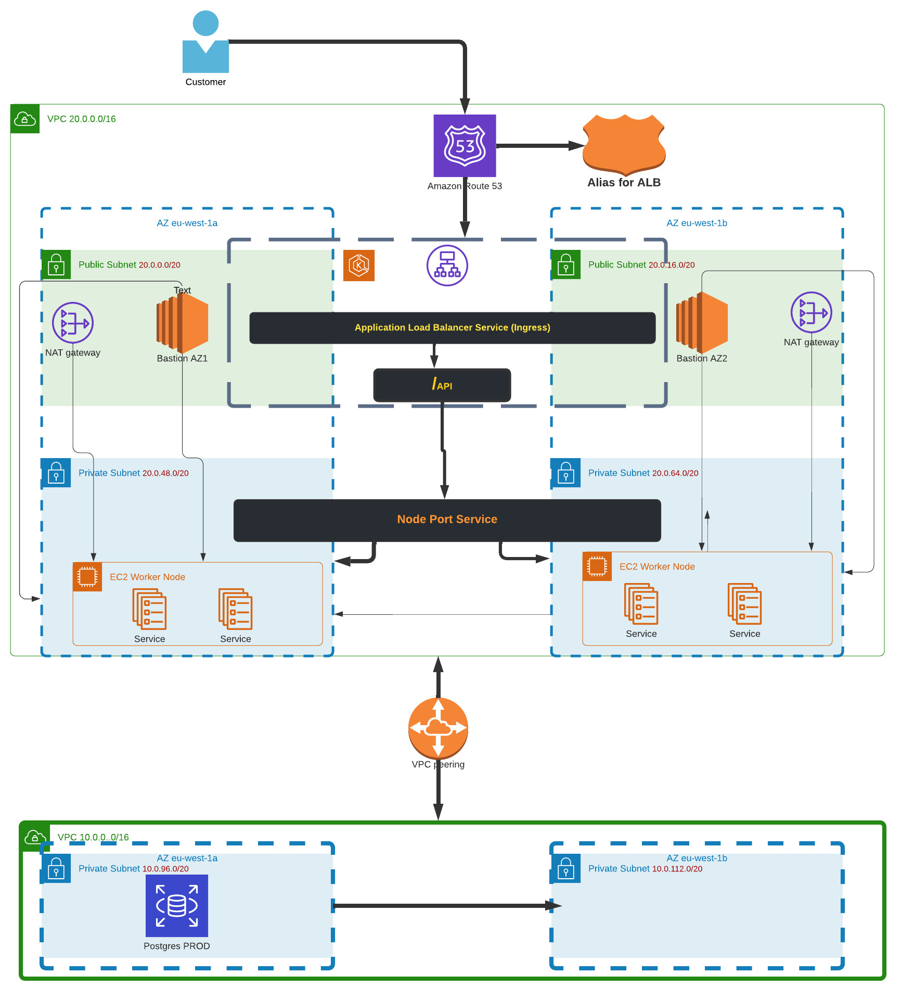

# AWS INFRA 

This docs describe the architecture of our dynamic infra deploy by Terraform via GitLab

## Structure 
The infra spin up via pipeline or command line will have the setup like the picture below 


## Infra Description

The infra generated from this repo will do a VPC peering in order to connect to the DB and Elasticache for **prod environment**.

This repo generate all the components for infra which are in the top part of the below pictures.

So all the resources which are in the **VPC with cidr block 20.0.0.0/16** are generated from this repo 

## Pre Requisites

If you want to spin up the infra via your local laptop, there are few prerequisite that you need to have.

Visit [this page](https://gitlab.com/noah-energy/infranoah/infra_aws/-/wikis/home#prerequisite) in order to setup your Terraform and aws cli

Usually running Terraform locally is enough for local development.

## Command to run to create infra

Once you got your aws configured, you can run terraform.

Initiate your terraform space running `terraform init` like in the example below

```
marcodivincenzo@Marcos-MacBook-Pro:[prod]:(main): terraform init
Initializing modules...
- db in ../../modules/database
- iam in ../../modules/iam
- jump_host in ../../modules/bastions
- k8s in ../../modules/eks
- lb in ../../modules/alb
- networking in ../../modules/vpc

Initializing the backend...

Successfully configured the backend "s3"! Terraform will automatically
use this backend unless the backend configuration changes.

Initializing provider plugins...
- Finding latest version of hashicorp/aws...
- Finding latest version of hashicorp/kubernetes...
- Installing hashicorp/aws v3.74.0...
- Installed hashicorp/aws v3.74.0 (signed by HashiCorp)
- Installing hashicorp/kubernetes v2.7.1...
- Installed hashicorp/kubernetes v2.7.1 (signed by HashiCorp)

Terraform has created a lock file .terraform.lock.hcl to record the provider
selections it made above. Include this file in your version control repository
so that Terraform can guarantee to make the same selections by default when
you run "terraform init" in the future.

Terraform has been successfully initialized!
```


After that we run `terraform plan` to have a detailed explanation about what is going to be created like in this example

```
terraform plan -var-file=dev.tfvars 
```
```
...
...
Plan: 62 to add, 0 to change, 0 to destroy.

Changes to Outputs:
  + alb_sg                = (known after apply)
  + arn_http_target_group = (known after apply)
  + azs                   = [
      + "eu-west-1a",
      + "eu-west-1b",
    ]
  + bastions_sg           = (known after apply)
  + db_sg                 = (known after apply)
  + db_subnets_cidr       = [
      + "20.0.96.0/20",
      + "20.0.112.0/20",
    ]
  + db_subnets_id         = [
      + (known after apply),
      + (known after apply),
    ]
  + eks_cluster_id        = (known after apply)
  + eks_endpoint          = (known after apply)
  + eks_sg                = (known after apply)
  + eks_subnets           = [
      + (known after apply),
      + (known after apply),
    ]
  + http_target_group     = "HTTP-TG-prod-env"
  + private_subnets_cidr  = [
      + "20.0.48.0/20",
      + "20.0.64.0/20",
    ]
  + private_subnets_id    = [
      + (known after apply),
      + (known after apply),
    ]
  + public_subnets_cidr   = [
      + "20.0.0.0/20",
      + "20.0.16.0/20",
    ]
  + public_subnets_id     = [
      + (known after apply),
      + (known after apply),
    ]
  + vpc_cidr_block        = "20.0.0.0/16"
  + vpc_id                = (known after apply)
```

Once you that you validated that everything is fine, you can run `terraform apply` like in this example. 


````
terraform apply -var-file=dev.tfvars 
````

## Destroy Infra

For destroy infra run this command 
````
terraform destroy -var-file=dev.tfvars 
````

**And you will prompted to type yes** in case you want destroy it

```
Plan: 0 to add, 0 to change, 64 to destroy.

Changes to Outputs:
  - alb_sg               = "sg-0bef360d68e6d78e7" -> null
  - azs                  = [
      - "eu-west-1a",
      - "eu-west-1b",
    ] -> null
  - bastions_sg          = "sg-0b27d9376513bb72a" -> null
  - db_sg                = "sg-0bc5ac36bcd7b5323" -> null
  - db_subnets_cidr      = [
      - "30.0.96.0/20",
      - "30.0.112.0/20",
    ] -> null
  - db_subnets_id        = [
      - "subnet-0c14096c8a0ef060a",
      - "subnet-0c54de546303da31a",
    ] -> null
  - eks_cluster_id       = "eks-dev-env" -> null
  - eks_endpoint         = "https://78CB6F4C6D7B95DF494650280F719A47.gr7.eu-west-1.eks.amazonaws.com" -> null
  - eks_sg               = "sg-0b9a935d806d35b38" -> null
  - eks_subnets          = [
      - "subnet-062a0de2d8bf09922",
      - "subnet-0754907ae48e70436",
    ] -> null
  - private_subnets_cidr = [
      - "30.0.48.0/20",
      - "30.0.64.0/20",
    ] -> null
  - private_subnets_id   = [
      - "subnet-062a0de2d8bf09922",
      - "subnet-0754907ae48e70436",
    ] -> null
  - public_subnets_cidr  = [
      - "30.0.0.0/20",
      - "30.0.16.0/20",
    ] -> null
  - public_subnets_id    = [
      - "subnet-00eddf9c02de34ae7",
      - "subnet-0cd99767ce9af4fca",
    ] -> null
  - vpc_cidr_block       = "30.0.0.0/16" -> null
  - vpc_id               = "vpc-0136fa86655536a2e" -> null

Do you really want to destroy all resources?
  Terraform will destroy all your managed infrastructure, as shown above.
  There is no undo. Only 'yes' will be accepted to confirm.

  Enter a value:
```

## Terraform modules description

Terraform modules descriptions [are explained at this url](https://noah-energy.gitlab.io/infranoah/infra_aws/)

## Automatic Terraform modules documentations

Each time that you add a new tf module, you need to follow these steps in order to create the docs

* Add module description inside the main.tf of the module. You can have a look at the existing one
* Add an entry inside the **mkdocs.yml** under the **modules section**
  * the entry need to be in the style like this => 'newModule' : 'newModule.md'
* Now you can run the script **TFDocsGenerator.sh** which will generate the actual module documentation based on the comment presents in the main.tf file

```
marcodivincenzo@Marcos-MacBook-Pro:[infra_aws]:(develop): ./TFDocsGenerator.sh
/Users/marcodivincenzo/Desktop/noah_repos/infra_aws/environments/dev/dev.md updated successfully
/Users/marcodivincenzo/Desktop/noah_repos/infra_aws/environments/prod/prod.md updated successfully
/Users/marcodivincenzo/Desktop/noah_repos/infra_aws/modules/bastions/bastions.md updated successfully
/Users/marcodivincenzo/Desktop/noah_repos/infra_aws/modules/eks/eks.md updated successfully
/Users/marcodivincenzo/Desktop/noah_repos/infra_aws/modules/iam/iam.md updated successfully
/Users/marcodivincenzo/Desktop/noah_repos/infra_aws/modules/vpc/vpc.md updated successfully
```